# UI Gallery

This page shows key Pinecone VS Code extension workflows.

## Explorer and navigation

### Explorer tree overview

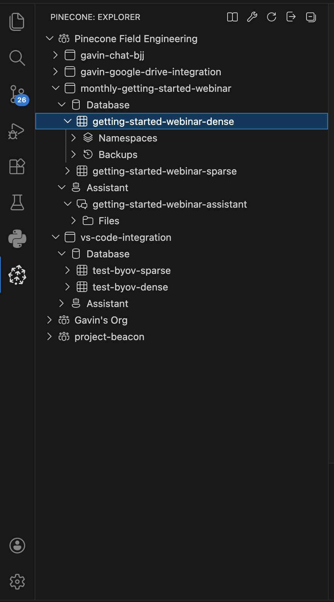

## Index workflows

### Create index: integrated embeddings

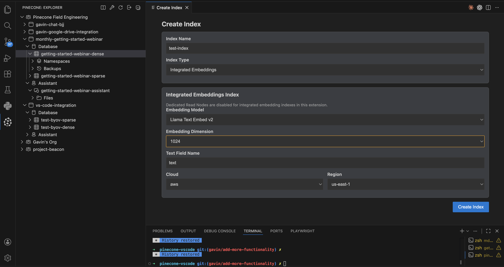

### Create index: BYOV with DRN

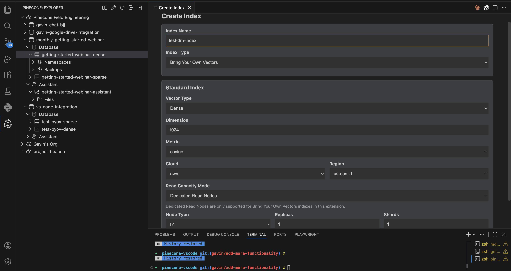

### Query results

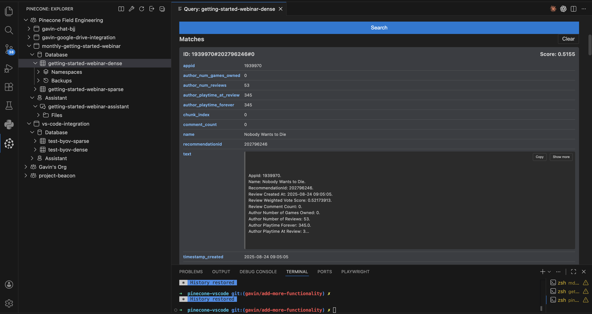

### Data Ops panel

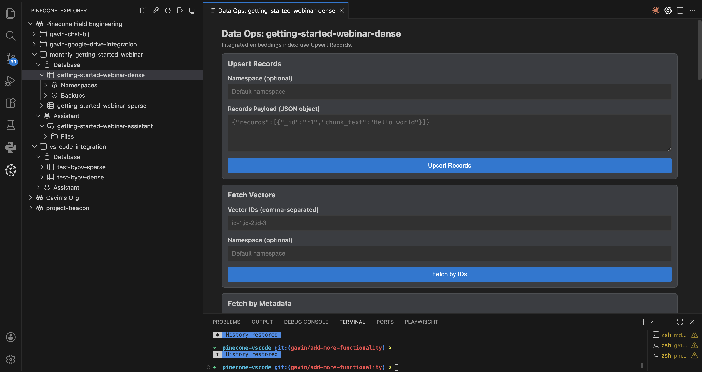

### Configure index

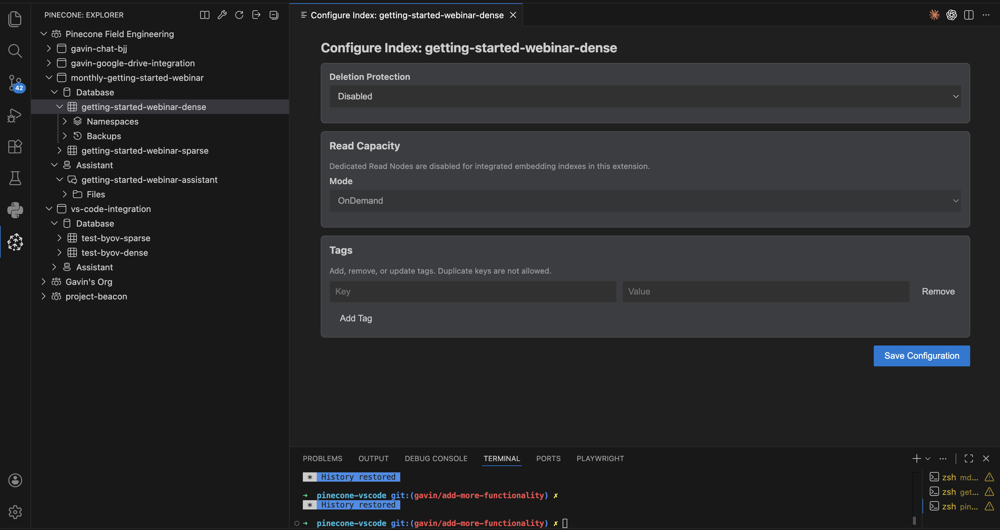

### Backup/Restore jobs

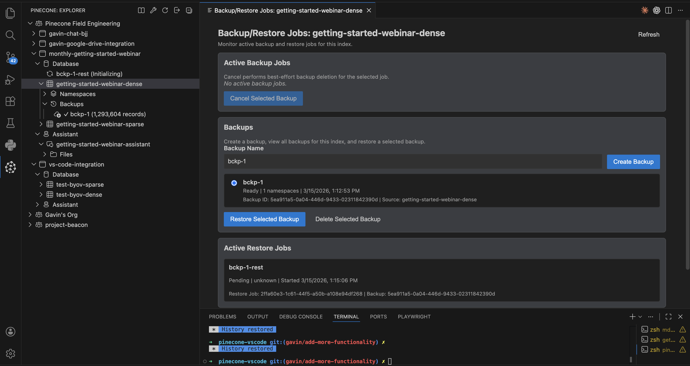

## Assistant workflows

### Assistant chat with citations

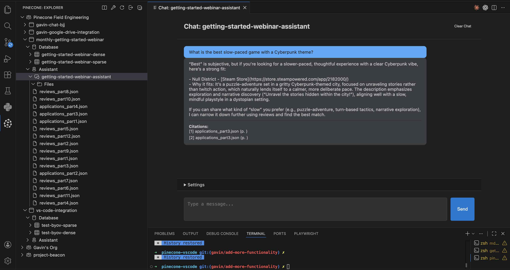

### Assistant file metadata upload dialog

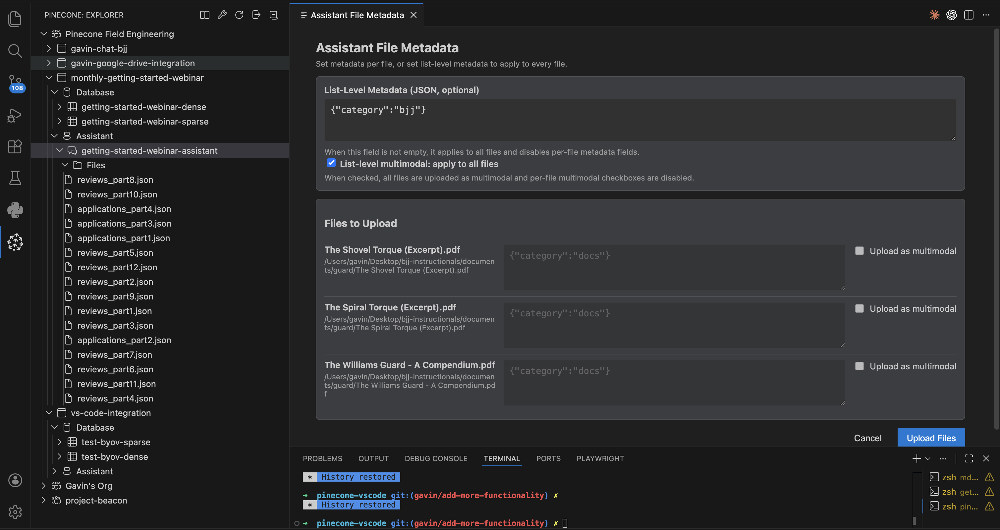

### Assistant file details dialog

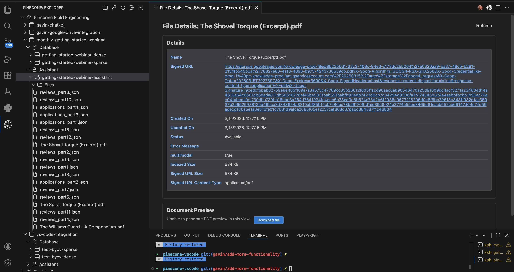

### Retrieve context results

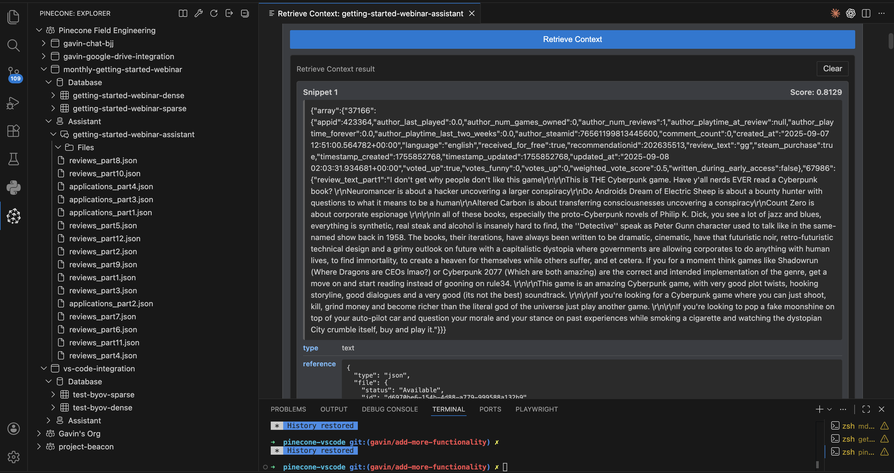

### Update assistant dialog

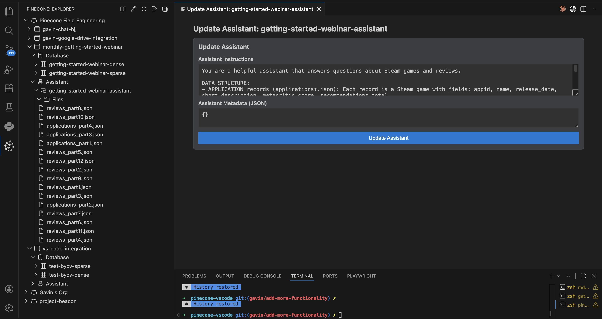

## Inference workflows

### Inference Toolbox overview

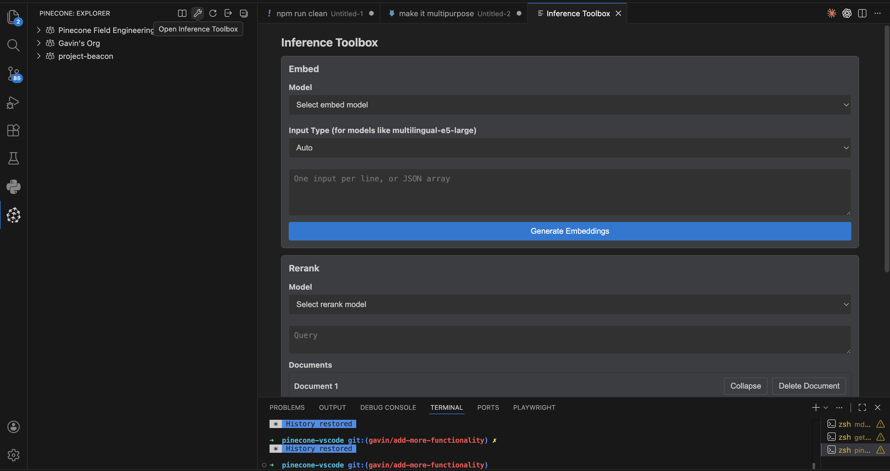

### Inference Toolbox embeddings result

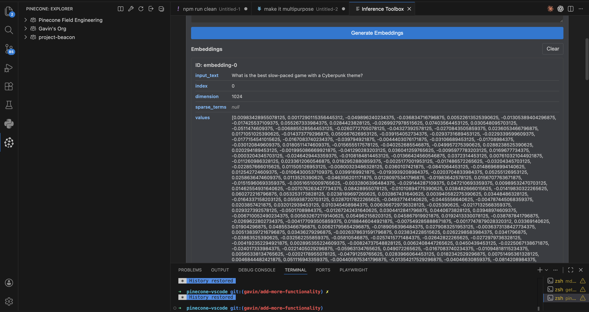

## Project/API workflows

### Project API key management panel

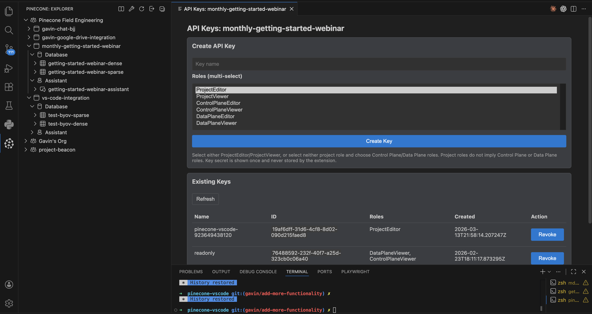
